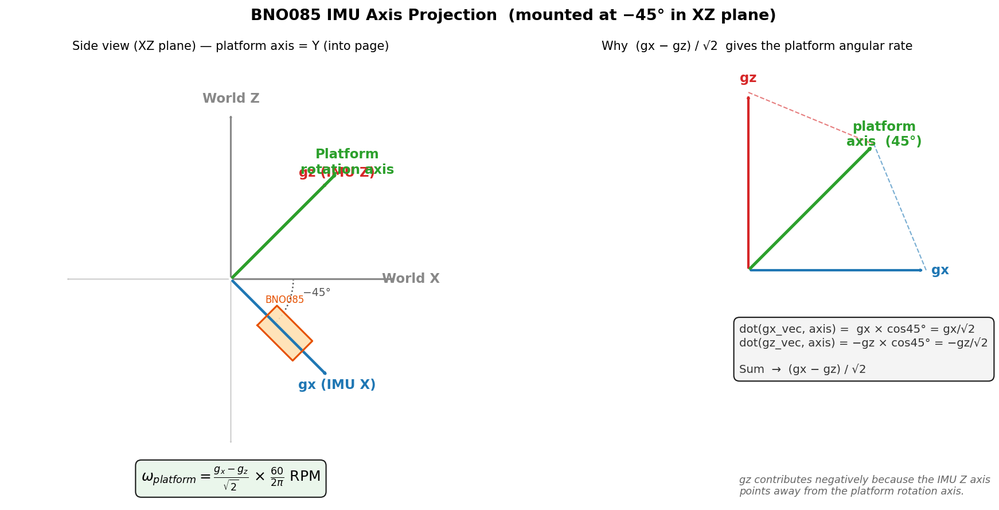
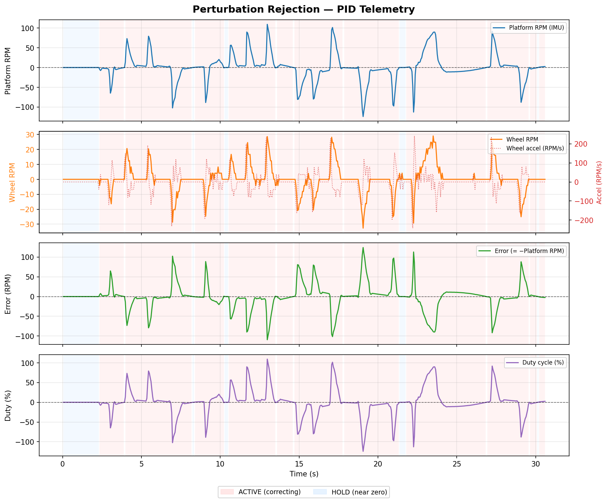
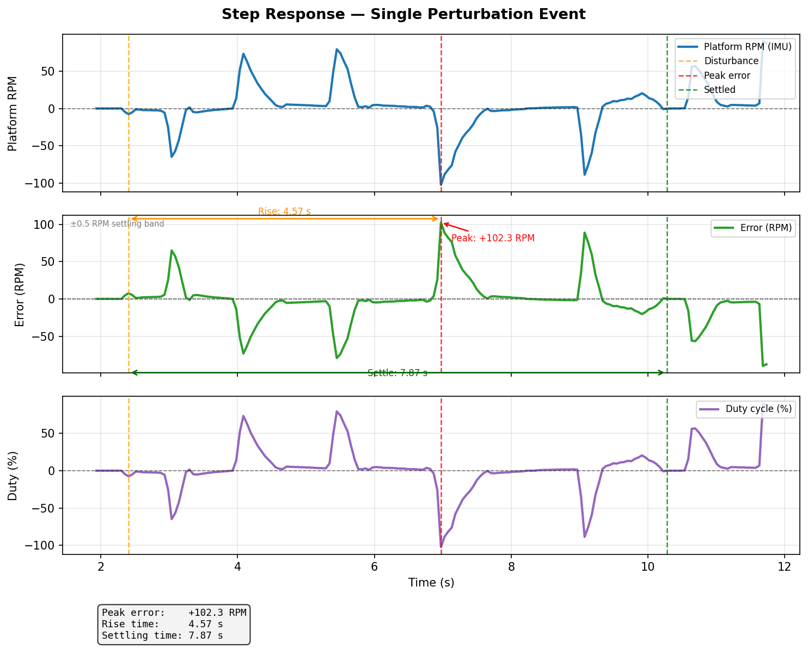
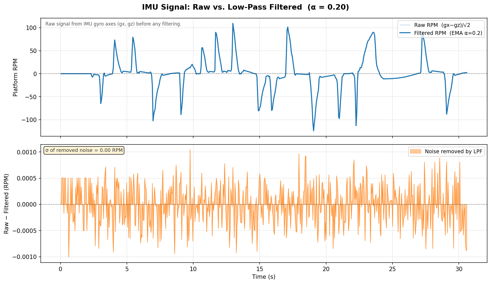
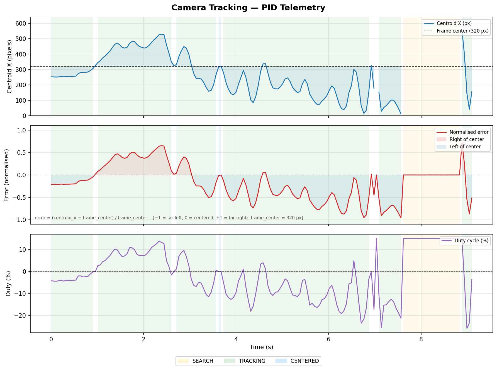
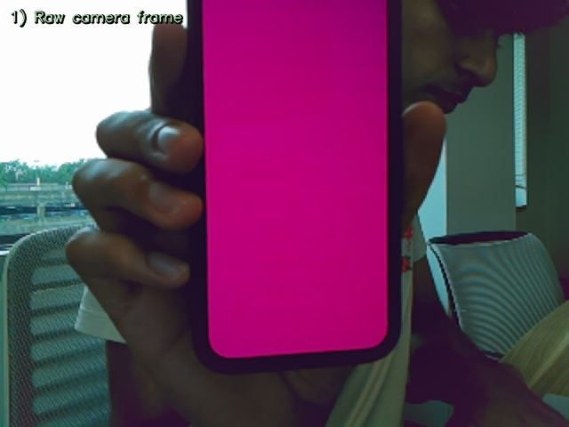
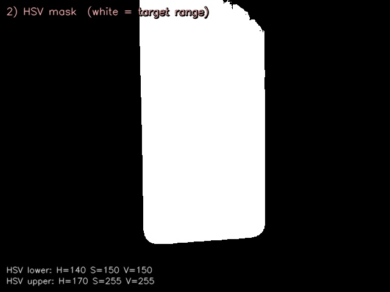
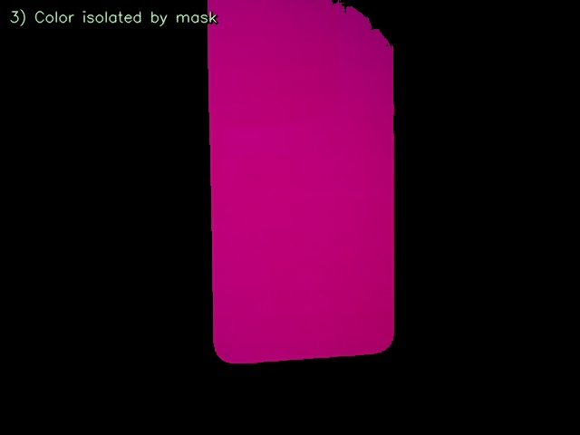
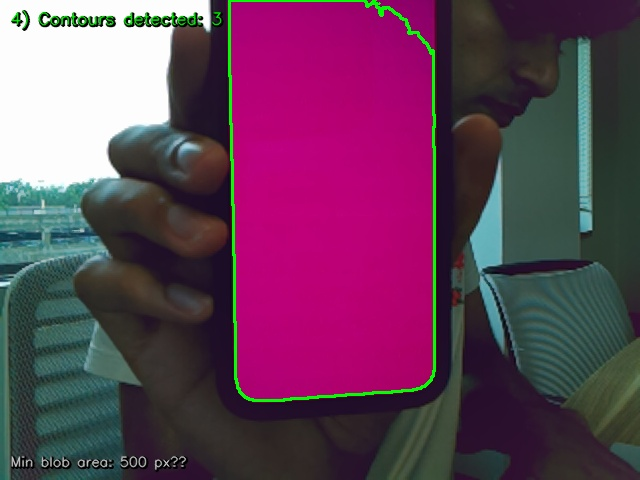
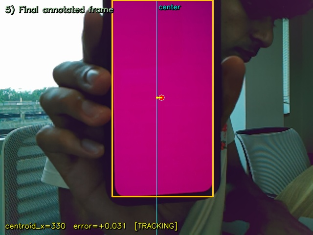

# ReactionWheelTestbed

A Raspberry Pi 5–based reaction wheel testbed for attitude control experiments. The platform uses a brushed DC motor + flywheel to demonstrate angular momentum exchange, closed-loop speed control, camera-based target tracking, and perturbation rejection — all driven by Python scripts over GPIO.

---

## Hardware

| Component | Details |
|---|---|
| Controller | Raspberry Pi 5 |
| Motor driver | BTS7960 H-bridge (RPWM / LPWM / R\_EN / L\_EN) |
| Motor | Brushed DC with 5:1 gearbox |
| Encoder | Quadrature encoder, 28 CPR (→ 280 counts/flywheel rev) |
| IMU | Bosch BNO085 via I²C (address `0x4A`) |
| Camera | Raspberry Pi Camera Module (via `picamera2`) |
| PWM frequency | 1000 Hz |

### GPIO Wiring

| Signal | GPIO (BCM) | Pi Pin | Wire |
|---|---|---|---|
| RPWM (forward) | 25 | 22 | T |
| LPWM (reverse) | 22 | 15 | U |
| R\_EN (speed) | 23 | 16 | V |
| L\_EN (speed) | 24 | 18 | W |
| Encoder Ch A | 17 | 11 | X |
| Encoder Ch B | 27 | 13 | Y |
| IMU SDA | 2 | 3 | — |
| IMU SCL | 3 | 5 | — |
| IMU PS1 | 3.3 V | 17 | — |

### IMU Axis Projection

The BNO085 is mounted at −45° in the XZ plane. Because neither the X nor Z gyro axis aligns with the platform's rotation axis, the platform angular rate is recovered by projecting both onto the 45° bisector:

```
platform_rpm = (gx − gz) / √2  ×  (60 / 2π)
```



---

## Dependencies

```bash
pip install lgpio gpiozero adafruit-circuitpython-bno08x picamera2 opencv-python numpy matplotlib
```

All scripts target `/usr/bin/python3`. Run as root (or a user with GPIO access) on the Raspberry Pi.

---

## File Reference

### Test / Diagnostic Scripts

#### `PWMTest.py`
Basic PWM sanity check using `gpiozero`. Steps the motor through 25 %, 50 %, 75 %, and 100 % duty cycles on GPIO 18 for 3 seconds each, then stops. Use this to verify the motor driver is wired and responding before running anything else.

```bash
python3 PWMTest.py
```

#### `pwmTest.py`
Lower-level equivalent using `lgpio` directly. Applies 10 %, 25 %, and 50 % duty cycles to GPIO 18 for 5 seconds each with no motor load required — useful for verifying PWM output with a multimeter (e.g., 50 % on 3.3 V → ~1.65 V DC).

```bash
python3 pwmTest.py
```

#### `directionTest.py`
Tests forward and reverse motor directions at 25 % duty using `lgpio`. Runs forward for 3 s, stops, then runs in reverse for 3 s. Use this to confirm that RPWM/LPWM polarity matches your physical wiring before running control loops.

```bash
python3 directionTest.py
```

#### `encoderTest.py`
Polls GPIO 17 (Ch A) and GPIO 27 (Ch B) and prints every state change to the terminal. Spin the flywheel by hand and confirm that edge counts appear. Useful for debugging encoder wiring before relying on RPM calculations.

```bash
python3 encoderTest.py
```

#### `imuTest.py`
Streams raw gyroscope (rad/s → °/s) and accelerometer (m/s²) data from the BNO085 at ~20 Hz. Use this to confirm I²C wiring is correct and that the IMU is responding before integrating it into a control loop.

```bash
python3 imuTest.py
```

#### `imuRPM.py`
Reads the BNO085 gyroscope, projects the reading onto the platform rotation axis `(gx − gz) / √2`, and displays the result in RPM with a 5-sample moving average. Also integrates rotation rate to show cumulative angle in degrees — spin the platform exactly one revolution to verify the ~360° reading. Useful for identifying the correct IMU axis and tuning the axis projection before closing the control loop.

```bash
python3 imuRPM.py
```

#### `cameraTest.py`
Captures a single 1280×720 frame from the Pi Camera, rotates it 180°, and saves it to `camera_snapshot.jpg`. Use this to confirm camera orientation and focus before running the tracking controller.

```bash
python3 cameraTest.py
```

---

### Motor Control Scripts

#### `simpleSpin.py`
Spins the reaction wheel at a fixed duty cycle (default 10 %) and prints live encoder-derived RPM to the terminal. Demonstrates basic motor + encoder integration using `gpiozero` on top of `lgpio`. Edit `DUTY_CYCLE` at the top of the file to change speed.

```bash
python3 simpleSpin.py
```

| Parameter | Default | Description |
|---|---|---|
| `DUTY_CYCLE` | `0.1` | Motor duty (0.0 – 1.0) |
| `COUNTS_PER_REV` | `280` | Encoder counts per flywheel revolution |
| `SAMPLE_PERIOD` | `0.2 s` | RPM print interval |

#### `spinTest.py`
More complete motor controller implemented as a `ReactionWheel` class using `lgpio` directly (Pi 5 compatible — avoids `gpiozero` hardware PWM conflicts). Runs at a configurable duty cycle and streams direction, duty %, measured RPM, and raw encoder count. Edit `TARGET_DUTY` at the top.

```bash
python3 spinTest.py
```

| Parameter | Default | Description |
|---|---|---|
| `TARGET_DUTY` | `10.0` | Duty cycle −100 to +100 % |
| `FLYWHEEL_MAX_RPM` | `1200` | Derived from 6000 RPM motor / 5:1 gearbox |
| `RPM_SAMPLE_PERIOD` | `0.1 s` | Encoder sampling interval |

---

### Closed-Loop Control Scripts

#### `checkpoint2.py`
**Platform speed control via IMU feedback.**

Prompts the user for a target platform RPM, then runs a PD controller that adjusts motor duty cycle to match it. Platform speed is measured from the BNO085 gyroscope; wheel speed from the encoder. Includes a safety stop if the platform exceeds 50 RPM.

```bash
python3 checkpoint2.py
# Enter desired platform RPM (e.g. 10, -10):
```

| Parameter | Default | Description |
|---|---|---|
| `KP` | `0.4` | Proportional gain |
| `KD` | `0.05` | Derivative gain |
| `FEEDFORWARD` | `10.0` | Base duty % to overcome static friction |
| `MAX_DUTY` | `20.0 %` | Duty cycle cap |
| `SAFETY_RPM` | `50.0` | Emergency stop threshold (platform) |

---

#### `demo_perturbation.py`
**Perturbation rejection (return-to-zero).**

Continuously targets 0 RPM for the platform. When an external disturbance (a hand-spin) is applied, the PID controller drives the reaction wheel to absorb the angular momentum and return the platform to rest. The IMU signal is low-pass filtered before use to reject sensor noise. Logs IMU, encoder, error, duty, PID terms, and state to `perturbation_log.csv`.

```bash
python3 demo_perturbation.py
```

| Parameter | Default | Description |
|---|---|---|
| `KP` | `1.0` | Proportional gain |
| `KI` | `0.75` | Integral gain |
| `KD` | `0.05` | Derivative gain |
| `INTEGRAL_MAX` | `1.0` | Anti-windup clamp on integral accumulator |
| `LPF_ALPHA` | `0.2` | IMU low-pass EMA coefficient (smaller = more smoothing) |
| `K_WHEEL_BRAKE` | `0.05` | Wheel momentum damping near zero |
| `DEADBAND_RPM` | `0.3` | Ignore errors smaller than this (RPM) |
| `MAX_DUTY` | `50.0 %` | Duty cycle cap |
| `SAFETY_RPM` | `150.0` | Emergency stop threshold (platform) |
| `MOTOR_SAFETY_RPM` | `120.0` | Emergency stop threshold (reaction wheel) |

**PID Telemetry:**



**Step Response — single perturbation event:**



**Raw vs. filtered IMU signal:**

The low-pass filter (EMA, α = 0.2) significantly reduces gyroscope noise before the signal reaches the PID controller. The plot below shows the raw signal reconstructed from the logged `gx`/`gz` columns alongside the filtered value actually used by the controller.



---

#### `cameraTracking.py`
**Vision-based attitude control.**

Uses the Pi Camera to detect a hot-pink target by HSV color thresholding, computes the horizontal error between the target centroid and the frame center, and drives the reaction wheel with a PID controller to keep the target centered. Camera exposure is fixed (no auto-exposure) to ensure consistent color detection under motion. Logs tracking data to `tracking_log.csv`.

```bash
python3 cameraTracking.py
# Hold the hot-pink target in view. Press Ctrl+C to stop.
```

| Parameter | Default | Description |
|---|---|---|
| `KP` | `20.0` | Proportional gain |
| `KI` | `1.0` | Integral gain |
| `KD` | `1.0` | Derivative gain |
| `INTEGRAL_MAX` | `20.0` | Anti-windup clamp |
| `MAX_DUTY` | `50.0 %` | Duty cycle cap |
| `DEADBAND` | `0.03` | Fraction of half-frame width to ignore |
| `SEARCH_DUTY` | `10.0 %` | Duty while scanning for target |
| `EXPOSURE_US` | `2000 µs` | Fixed shutter speed (2 ms) |
| `ANALOGUE_GAIN` | `4.0` | Fixed ISO-like gain |
| `HSV_LOWER/UPPER` | H: 140–170 | Hue range for hot-pink target detection |
| `MIN_BLOB_AREA` | `500 px²` | Minimum contour area to count as target |

The controller operates in three states:

- **SEARCH** — Target not found; motor runs at `SEARCH_DUTY` to scan.
- **TRACKING** — Target visible and outside deadband; PID output applied.
- **CENTERED** — Target within deadband; motor stopped.

**Camera Tracking PID Telemetry:**



### Camera Detection Pipeline

`camera_viz.py` captures a single frame and saves five annotated images showing each stage of the color-blob detection pipeline used by `cameraTracking.py`.

```bash
python3 camera_viz.py
```

| Stage | Image | Description |
|---|---|---|
| 1 |  | Raw rotated camera frame |
| 2 |  | Binary mask — white pixels are within the hot-pink HSV range |
| 3 |  | Original color visible only where the mask is active |
| 4 |  | All detected contours drawn in green |
| 5 |  | Final result: bounding box, centroid dot, error arrow to frame center, state label |

---

## Visualization / Plotting Scripts

All plot scripts read the CSV logs written by the demo scripts and save PNG figures. Run them after stopping a demo to visualize the recorded data.

| Script | Input | Output | Description |
|---|---|---|---|
| `plot_perturbation.py` | `perturbation_log.csv` | `perturbation_plot.png` | 4-panel PID telemetry (platform RPM, wheel RPM, error, duty) |
| `plot_tracking.py` | `tracking_log.csv` | `tracking_plot.png` | 3-panel tracking telemetry (centroid X, error, duty) |
| `plot_step_response.py` | `perturbation_log.csv` | `step_response_plot.png` | Zoomed single-event plot with rise time and settling time annotations |
| `plot_imu_filter.py` | `perturbation_log.csv` | `imu_filter_plot.png` | Raw vs. LPF-filtered IMU signal comparison |
| `plot_imu_axis.py` | *(none)* | `imu_axis_diagram.png` | Static diagram of the −45° IMU axis projection |
| `plot_pid_breakdown.py` | `perturbation_log.csv` | `pid_breakdown_plot.png` | Stacked P/I/D term contribution plot (requires updated log) |
| `camera_viz.py` | *(live camera)* | `viz_1…5.jpg` | 5-stage color-blob detection pipeline images |

---

## Log Files

| File | Generated by | Contents |
|---|---|---|
| `perturbation_log.csv` | `demo_perturbation.py` | Timestamp, gx, gz, IMU RPM, wheel RPM, error, duty, state, p\_term, i\_term, d\_term |
| `tracking_log.csv` | `cameraTracking.py` | Timestamp, centroid\_x, error, duty, state |
| `camera_snapshot.jpg` | `cameraTest.py` | Single camera frame for orientation check |

---

## Development Progression

The scripts follow a natural bring-up sequence:

```
Hardware verification
  PWMTest.py / pwmTest.py      ← motor driver alive?
  directionTest.py             ← forward/reverse correct?
  encoderTest.py               ← encoder wired?
  imuTest.py / imuRPM.py      ← IMU communicating?
  cameraTest.py                ← camera oriented?

Open-loop motor control
  simpleSpin.py                ← spin + read encoder RPM
  spinTest.py                  ← structured class, Pi 5 lgpio

Closed-loop control
  checkpoint2.py               ← IMU-based speed control
  demo_perturbation.py         ← disturbance rejection
  cameraTracking.py            ← vision-based attitude control
```

---

## Notes

- All control scripts use `lgpio` directly for Pi 5 GPIO compatibility. Scripts that import `gpiozero` (`simpleSpin.py`, `checkpoint2.py`) use it with the `LGPIOFactory` backend for the same reason.
- Positive duty → reaction wheel spins forward → platform rotates in the opposite direction (conservation of angular momentum).
- The IMU axis projection `(gx − gz) / √2` compensates for the sensor being mounted at 45° relative to the platform rotation axis.
- Log file paths are hardcoded to `/home/fri/Desktop/ReactionWheelTestbed/` — update these if your working directory differs.
